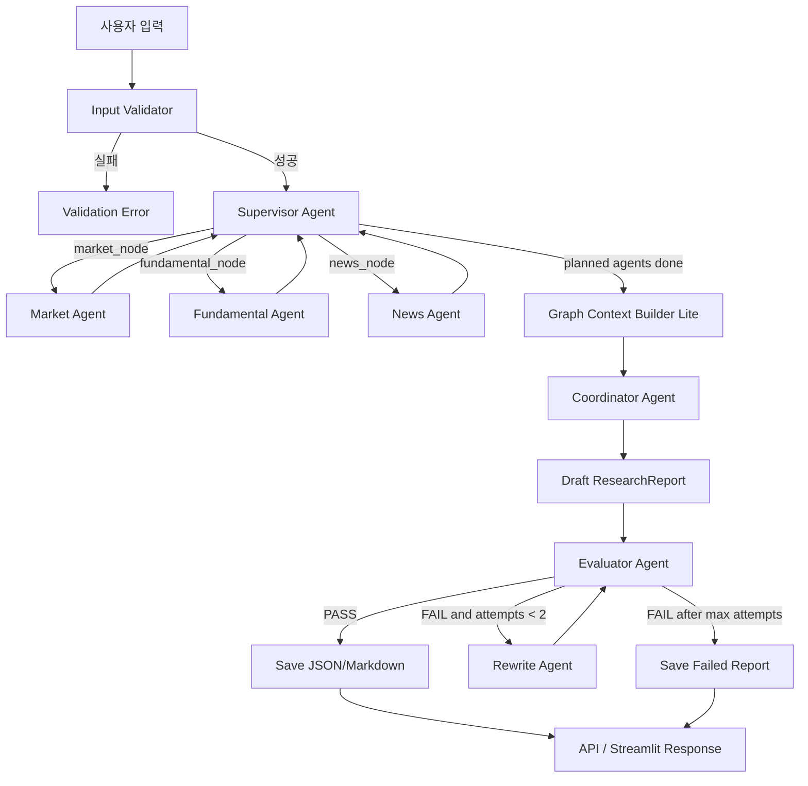
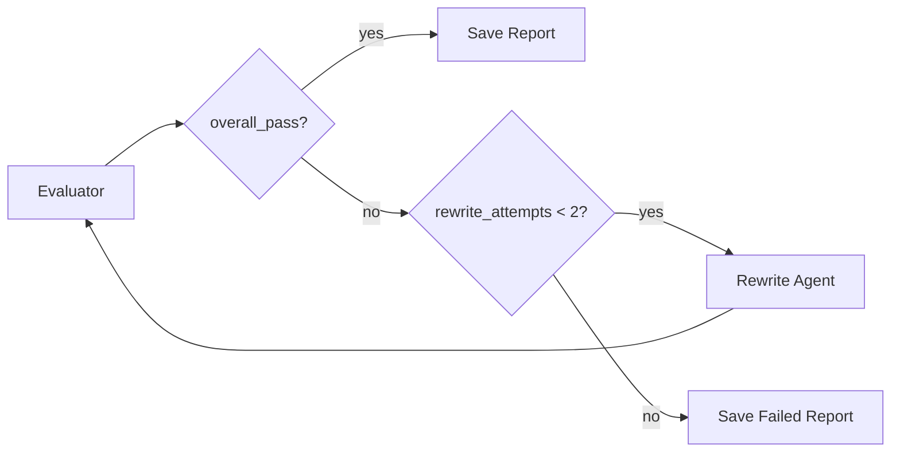

# FinSight Guard

FinSight Guard는 LangGraph 기반의 증거 중심 금융 리서치 멀티 에이전트 워크플로우입니다. 시장 데이터, 재무 데이터, 뉴스 근거를 수집하고, Supervisor가 질문 유형에 맞게 필요한 분석 Agent를 라우팅한 뒤, Coordinator와 Evaluator/Rewrite 루프를 통해 한국어 리서치 보고서를 생성합니다.

이 프로젝트는 주식 추천 시스템이 아닙니다. 자동매매, 증권사 주문 실행, 매수/매도/보유 권유, 수익 보장 기능을 포함하지 않습니다.


## 프로젝트 목적

금융 리서치는 가격 데이터, 재무 지표, 뉴스 이벤트, 리스크 해석, 안전 문구가 함께 필요한 영역입니다. 단순 챗봇 방식은 근거 없는 수치나 직접적인 투자 권유 문장을 만들기 쉽습니다.

FinSight Guard는 다음 패턴을 포트폴리오 수준으로 보여주는 것을 목표로 합니다.

- LangGraph 기반 조건부 멀티 에이전트 워크플로우
- 질문 유형에 따른 Supervisor 기반 동적 라우팅
- Market/Fundamental/News Agent의 역할 분리
- `EvidenceItem` 기반 근거 추적
- Lightweight Graph RAG 방식의 `GraphContext`
- 한국어 시나리오 기반 보고서 생성
- Evaluator Agent의 책임 있는 AI 검수
- Rewrite Agent를 통한 안전 문구와 근거 보강
- 로컬 JSON/Markdown 보고서 저장, 로그, metrics, FastAPI, Streamlit, Docker, pytest

## 안전 원칙

FinSight Guard는 투자 자문 서비스가 아니라 교육 및 정보 제공 목적의 리서치 보조 도구입니다.

금지하는 동작:

- 실제 매매
- 증권사/Broker API 연동
- 주문 실행
- 포트폴리오 자동 운용
- 특정 종목 매수/매도/보유 권유
- 수익, 원금, 목표가 보장
- 근거 없는 재무 사실 또는 뉴스 생성

모든 최종 보고서는 다음 고지문을 포함해야 합니다.

```text
본 보고서는 교육 및 정보 제공 목적의 AI 리서치 결과이며, 특정 종목의 매수·매도·보유를 권유하지 않습니다. 최종 투자 판단과 책임은 투자자 본인에게 있습니다.
```

## 현재 워크플로우

초기 버전은 Market -> Fundamental -> News 순차 실행이었지만, 현재 구조는 Supervisor 기반 동적 라우팅입니다.

```text
START
  -> input_validator_node
  -> supervisor_node
     -> market_node / fundamental_node / news_node
     -> supervisor_node 반복
  -> graph_context_node
  -> coordinator_node
  -> evaluator_node
     -> PASS: save_report_node -> END
     -> FAIL and rewrite_attempts < 2: rewrite_node -> evaluator_node
     -> FAIL after max attempts: save_report_node -> END
```



## Supervisor 라우팅

Supervisor는 사용자 질문을 다음 질문 유형 중 하나로 분류합니다.

| question_type | 기본 실행 계획 | 목적 |
| --- | --- | --- |
| `technical_analysis` | `market -> news` | 차트, 단기, RSI, MACD, 추세 등 |
| `fundamental_analysis` | `fundamental -> news` | 저평가, 재무, PER, PBR, ROE, 장기 관점 등 |
| `news_risk_analysis` | `news -> market -> fundamental` | 최근 뉴스, 악재, 규제, 소송, 리스크 등 |
| `comprehensive_report` | `market -> fundamental -> news` | 종합 보고서, 전체 리서치 |
| `safety_or_unclear` | `market -> fundamental -> news` | 직접 조언 요청 또는 불명확한 질문 |

기본 Supervisor는 deterministic keyword rule로 동작합니다. 테스트가 안정적으로 재현되도록 기본값은 LLM을 사용하지 않습니다.

### Optional LLM Supervisor

LLM Supervisor는 선택 기능입니다. 활성화되어도 LLM은 분석 라우팅만 결정합니다. 투자 조언, 매수/매도/보유 추천, 재무 사실, 뉴스, evidence를 생성하지 않습니다.

활성화 조건:

```bash
ENABLE_LLM_SUPERVISOR=true
OPENAI_API_KEY=...
LLM_SUPERVISOR_MODEL=gpt-4o-mini
```

비활성화 또는 실패 시:

- `ENABLE_LLM_SUPERVISOR=false`이면 rule-based Supervisor 사용
- `OPENAI_API_KEY`가 없으면 rule-based Supervisor 사용
- LLM 응답이 invalid JSON이면 fallback
- 알 수 없는 agent나 question type이면 fallback
- 직접 조언형 질문은 LLM을 호출하지 않고 `safety_or_unclear`로 처리

허용되는 agent는 `market`, `fundamental`, `news`뿐입니다.

## Agent 책임

| Agent | 책임 | 출력 |
| --- | --- | --- |
| Input Validator | ticker, 투자 기간, 위험 성향 검증 | `UserInput`, normalized ticker |
| Supervisor Agent | 질문 유형 분류, 실행할 Agent 순서 결정 | `SupervisorPlan` |
| Market Agent | yfinance 가격 이력 수집, MA/RSI/MACD/ATR 계산 | `MarketAnalysis`, market `EvidenceItem` |
| Fundamental Agent | yfinance 기업/재무 지표 수집, 누락 필드 처리 | `FundamentalAnalysis`, fundamental `EvidenceItem` |
| News Agent | Tavily/Firecrawl 또는 mock provider로 뉴스/이벤트 리스크 수집 | `NewsAnalysis`, news `EvidenceItem` |
| Graph Context Builder Lite | EvidenceItem에서 관계 그래프 컨텍스트 생성 | `GraphContext` |
| Coordinator Agent | 분석 결과와 GraphContext를 결합해 한국어 보고서 생성 | `ResearchReport` |
| Evaluator Agent | 안전성, 근거성, 리스크, 한계, 고지문 검수 | `EvaluationResult` |
| Rewrite Agent | 실패한 보고서의 안전 문구, 근거, 한계, GraphContext 반영 보강 | 수정된 `ResearchReport` |

## Evidence와 GraphContext

중요한 수치나 사실 주장은 `EvidenceItem`으로 추적합니다.

```text
evidence_id
source_type
source_name
source_url
collected_at
ticker
metric_name
metric_value
description
```

최종 보고서는 evidence summary에 실제 존재하는 evidence ID만 포함해야 합니다. Supervisor가 일부 Agent를 건너뛴 경우에도 누락된 분석은 실패로 조작하지 않고 scope limitation으로 명시합니다.

GraphContext는 외부 graph DB나 vector DB를 쓰지 않는 lightweight JSON/Pydantic 구조입니다.

```text
GraphContext
  - ticker
  - focus
  - nodes
  - edges
  - key_relations_summary
  - risk_relations
  - positive_relations
  - evidence_ids
```

GraphContext는 다음 목적으로 사용됩니다.

- EvidenceItem에서 추출한 risk/event/metric/source 관계 요약
- 리스크 관계를 보고서의 `"관계 기반 리스크 및 근거 요약"` 섹션에 반영
- Evaluator가 graph risk relation이 보고서에 반영됐는지 확인

## Evaluator와 Rewrite Loop

Evaluator Agent는 다음 항목을 검수합니다.

- 금지된 투자 권유 문구
- 필수 고지문
- 리스크 공시
- 분석 한계
- evidence summary 존재 여부
- 보고서 본문에 존재하지 않는 evidence ID가 참조되는지 여부
- Supervisor 계획상 실행되어야 했던 Agent 결과가 누락됐는지 여부
- skipped agent가 failure가 아니라 scope limitation으로 처리됐는지 여부
- GraphContext risk relation이 보고서에 반영됐는지 여부
- data date와 freshness

검수 결과는 `EvaluationResult`로 반환됩니다.

```text
overall_pass
source_grounding_score
numeric_consistency_score
safety_score
risk_disclosure_score
freshness_score
issues
revision_suggestions
```

Evaluator가 실패하면 Rewrite Agent가 보고서를 수정하고 Evaluator가 다시 검수합니다. 무한 루프를 막기 위해 rewrite는 최대 2회로 제한됩니다.



Rewrite Agent는 없는 evidence, metric, URL, 뉴스 사실을 만들지 않습니다. 근거가 부족한 경우에는 limitation을 추가합니다.

## 기술 스택

- Python 3.11+
- LangGraph
- Pydantic
- yfinance
- pandas, numpy
- OpenAI SDK
- FastAPI
- Streamlit
- Docker, Docker Compose
- pytest

## 설치

```bash
python -m venv .venv
source .venv/bin/activate
pip install -r requirements.txt
cp .env.example .env
```

선택 환경 변수:

```bash
OPENAI_API_KEY=
TAVILY_API_KEY=
FIRECRAWL_API_KEY=
LLM_MODEL=gpt-4o-mini
ENABLE_LLM_SUPERVISOR=false
LLM_SUPERVISOR_MODEL=gpt-4o-mini
REPORT_DIR=reports
LOG_DIR=logs
```

뉴스 provider key가 없으면 workflow는 deterministic mock news fallback을 사용합니다.

## Streamlit 실행

```bash
streamlit run app.py
```

기본 URL:

```text
http://localhost:8501
```

현재 Streamlit UI는 ticker, 투자 기간, 위험 성향 입력을 중심으로 동작합니다. 별도 자유 질문 입력은 `run_research_workflow(..., user_query=...)`에서 지원되며, UI 연결은 후속 개선 대상입니다.

## FastAPI 실행

```bash
uvicorn main:app --reload
```

기본 URL:

```text
http://localhost:8000
```

API 엔드포인트:

```text
GET  /health
GET  /metrics
POST /analyze
GET  /reports/{run_id}
```

요청 예시:

```bash
curl -X POST http://localhost:8000/analyze \
  -H "Content-Type: application/json" \
  -d '{"ticker":"AAPL","investment_horizon":"중기","risk_profile":"중립형"}'
```

현재 FastAPI 요청 모델도 ticker, 투자 기간, 위험 성향 중심입니다. 자유 질문 기반 dynamic routing을 API 입력으로 노출하는 작업은 다음 단계에서 연결할 수 있습니다.

## Python API 예시

```python
from src.graph.workflow import run_research_workflow

result = run_research_workflow(
    ticker="AAPL",
    investment_horizon="장기",
    risk_profile="중립형",
    user_query="최근 악재 때문에 위험해?",
)

print(result["supervisor_plan"].question_type)
print(result["final_report"].title)
```

## Docker 실행

FastAPI와 Streamlit 서비스를 함께 실행합니다.

```bash
docker compose up --build
```

서비스 URL:

```text
FastAPI:   http://localhost:8000
Streamlit: http://localhost:8501
```

`docker-compose.yml`은 로컬 `reports/`, `logs/` 디렉터리를 컨테이너에 마운트합니다.

## 테스트

```bash
python -m compileall src
pytest
```

현재 Codex 실행 환경처럼 `python` 또는 `pytest`가 PATH에 없고 가상환경에만 있을 경우:

```bash
.venv/bin/python -m compileall src
.venv/bin/pytest
```

테스트는 deterministic하게 동작하도록 설계했습니다. 외부 API 호출은 mock 또는 fallback으로 대체하며, live yfinance/Tavily/Firecrawl/OpenAI 호출에 의존하지 않습니다.

현재 주요 테스트 범위:

- technical indicator
- evidence schema
- safety checker
- supervisor routing
- graph context builder
- coordinator
- evaluator
- rewrite
- workflow routing
- workflow E2E
- FastAPI health/analyze
- report storage

## 예시 출력

축약된 보고서 예시:

```text
Title: AAPL 증거 기반 AI 리서치 보고서
Data date: 2026-05-12

요약:
AAPL에 대해 시장, 펀더멘털, 뉴스 근거를 종합해 관망, 분할 접근, 리스크 회피 관점의 시나리오를 검토할 수 있습니다.

관계 기반 리스크 및 근거 요약:
- risk:규제 -> company:AAPL: negative_risk, evidence_id=news_001

시나리오 분석:
1. 관망 시나리오: 현재 확인된 시장, 재무, 뉴스 근거를 바탕으로 추가 데이터와 이벤트를 계속 점검하는 시나리오입니다.
2. 분할 접근 시나리오: 단일 판단에 의존하지 않고 여러 데이터 시점의 근거를 나누어 검토할 수 있습니다.
3. 리스크 회피 시나리오: 근거 부족, 변동성 확대, 부정적 이벤트가 확인될 경우 보수적으로 검토할 수 있습니다.

근거 요약:
1. evidence_id=market_001; source_type=market; metric_name=RSI; metric_value=58.2; description=RSI는 중립 구간입니다.
2. evidence_id=fundamental_001; source_type=fundamental; metric_name=PER; metric_value=28.1; description=PER 기준 밸류에이션 비교가 필요합니다.
3. evidence_id=news_001; source_type=news; metric_name=news_item; metric_value=None; description=최근 악재와 규제 리스크가 언급되었습니다.

고지문:
본 보고서는 교육 및 정보 제공 목적의 AI 리서치 결과이며, 특정 종목의 매수·매도·보유를 권유하지 않습니다. 최종 투자 판단과 책임은 투자자 본인에게 있습니다.
```

Evaluator 결과 예시:

```json
{
  "overall_pass": true,
  "source_grounding_score": 1.0,
  "numeric_consistency_score": 1.0,
  "safety_score": 1.0,
  "risk_disclosure_score": 1.0,
  "freshness_score": 1.0,
  "issues": [],
  "revision_suggestions": []
}
```

## 저장과 관측성

- 보고서 JSON/Markdown은 `reports/`에 저장됩니다.
- workflow run 기록은 run store에 저장됩니다.
- 구조화 로그는 `logs/`에 기록됩니다.
- `/metrics`는 in-memory runtime metrics를 반환합니다.

metrics 예시:

```text
total_runs
successful_runs
failed_runs
average_evaluation_score
```

## 한계

- 이 프로젝트는 MVP/포트폴리오 목적의 연구 보조 시스템이며 production 금융 플랫폼이 아닙니다.
- `yfinance` 데이터는 지연, 누락, 비가용, rate limit 영향을 받을 수 있습니다.
- 뉴스 provider key가 없거나 provider 호출이 실패하면 mock data로 대체됩니다.
- GraphContext는 JSON/Pydantic 기반 경량 구조이며 Neo4j, vector DB, Redis 같은 외부 인프라를 사용하지 않습니다.
- Evaluator는 규칙 기반 검수 중심이며 완전한 컴플라이언스 시스템이 아닙니다.
- numeric consistency 검사는 아직 모든 문장과 모든 evidence 값을 완전하게 교차 검증하지 않습니다.
- Streamlit/FastAPI의 자유 질문 입력 연결은 후속 개선 대상입니다.
- runtime metrics는 in-memory 방식이라 프로세스 재시작 시 초기화됩니다.
- 보고서는 로컬 파일 시스템에 저장되며 production database를 사용하지 않습니다.

## 향후 개선

- FastAPI/Streamlit에 `user_query` 입력 노출
- `.env.example`에 LLM Supervisor 설정 명시
- Report markdown export에 `graph_context_section` 포함
- numeric consistency 교차검증 고도화
- GraphContext entity/relation extraction 정교화
- Tavily/Firecrawl provider 통합 테스트 확대
- Docker 기반 end-to-end smoke test
- 로그/metrics dashboard 개선
