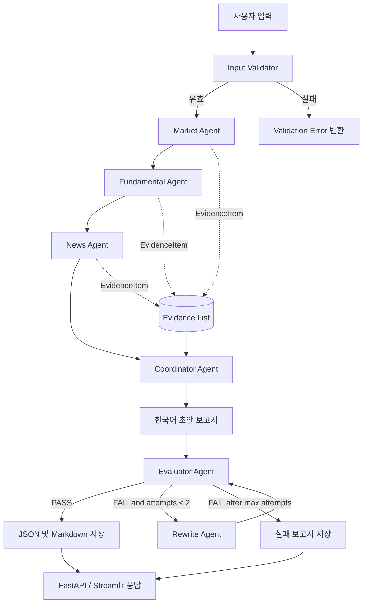
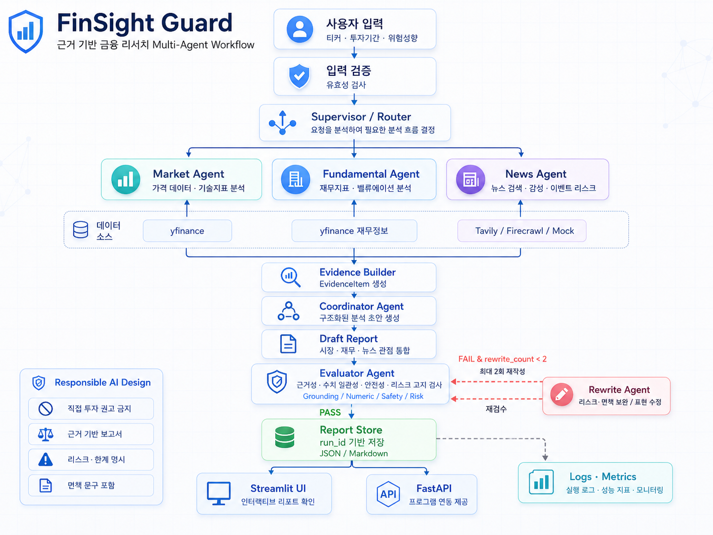
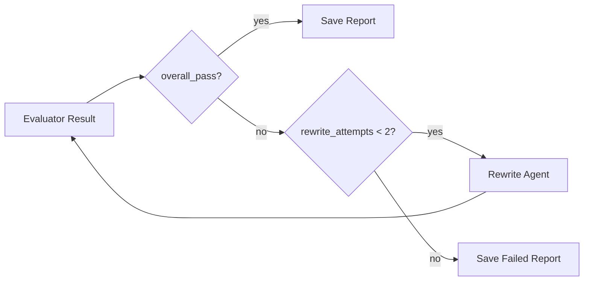

# FinSight Guard

LangGraph 기반의 증거 중심 금융 리서치 멀티 에이전트 워크플로우입니다. 시장 데이터, 재무 데이터, 뉴스 근거를 수집하고 Evaluator Agent가 안전성과 근거성을 검수한 뒤 한국어 리서치 보고서를 생성합니다.

## 주식 추천 시스템이 아닌 이유

FinSight Guard는 투자 자문 서비스, 자동매매 시스템, 주식 추천 엔진이 아닙니다. 이 프로젝트는 주문을 실행하지 않고, 증권사 API와 연결하지 않으며, 수익을 보장하거나 특정 종목의 매수, 매도, 보유를 지시하지 않습니다.

목표는 사용자가 시장, 펀더멘털, 뉴스 근거를 바탕으로 여러 시나리오를 비교할 수 있도록 돕는 것입니다. 모든 최종 보고서는 리스크, 한계, 근거 요약, 필수 고지문을 포함해야 합니다.

필수 고지문:

```text
본 보고서는 교육 및 정보 제공 목적의 AI 리서치 결과이며, 특정 종목의 매수·매도·보유를 권유하지 않습니다. 최종 투자 판단과 책임은 투자자 본인에게 있습니다.
```

## 문제 정의

금융 리서치는 실시간성 데이터, 정량 지표, 뉴스 해석, 민감한 투자 표현이 함께 섞이는 영역입니다. 단순 챗봇 방식은 근거가 부족한 주장이나 직접적인 투자 권유 문장을 생성하기 쉽습니다.

이 프로젝트는 다음과 같은 더 안전한 멀티 에이전트 패턴을 보여주는 것을 목표로 합니다.

- 데이터 수집과 분석 책임을 에이전트별로 분리
- 중요한 수치와 사실 주장에 구조화된 EvidenceItem 연결
- 관망, 분할 접근, 리스크 회피 중심의 한국어 시나리오 보고서 생성
- Evaluator Agent가 근거성, 안전성, 리스크, 최신성, 고지문을 검수
- 실패한 보고서는 Rewrite Agent로 보내 수정 후 재평가

## 주요 기능

- 명시적인 노드 라우팅을 가진 LangGraph 워크플로우
- `yfinance` 가격 데이터를 사용하는 Market Agent
- 기술적 지표 계산: MA20, MA60, MA120, RSI, MACD, ATR
- `yfinance` 재무 지표를 사용하는 Fundamental Agent
- 뉴스 검색 provider 경로와 deterministic mock fallback
- 출처 기반 사실 추적을 위한 `EvidenceItem` 스키마
- 한국어 시나리오 기반 보고서 생성
- Responsible AI 검수를 위한 Evaluator Agent
- 안전하지 않거나 불완전한 보고서를 수정하는 Rewrite Agent
- 입력 검증 실패, 평가 통과/실패, rewrite 제한에 대한 조건부 분기
- JSON 및 Markdown 보고서 저장
- 구조화 로그와 기본 런타임 metrics
- Streamlit UI와 FastAPI API
- Docker 및 Docker Compose 지원
- 외부 API에 의존하지 않는 deterministic pytest 테스트

## 아키텍처 다이어그램



## LangGraph 워크플로우

주요 워크플로우는 `src/graph/workflow.py`에 구현되어 있습니다.

```text
START
  -> input_validator_node
  -> market_node
  -> fundamental_node
  -> news_node
  -> coordinator_node
  -> evaluator_node
     -> PASS: save_report_node -> END
     -> FAIL: rewrite_node -> evaluator_node
     -> FAIL after max attempts: save_report_node -> END
```



주요 라우팅 동작:

- ticker 입력이 유효하지 않으면 validation error와 함께 조기 종료
- market data 실패는 node-level error handling을 통해 degraded mode로 처리
- 뉴스 provider key가 없거나 provider 호출이 실패하면 mock news fallback 사용
- Evaluator가 실패를 반환하면 Rewrite Agent로 라우팅
- rewrite는 설정된 최대 횟수 이후 중단

## Agent 책임

| Agent | 책임 | 출력 |
| --- | --- | --- |
| Market Agent | 가격 이력 수집, 기술 지표 계산, 추세/모멘텀/변동성 요약 | `MarketAnalysis`, market `EvidenceItem` |
| Fundamental Agent | 기업 정보와 재무 지표 수집, 누락 필드 처리 | `FundamentalAnalysis`, fundamental `EvidenceItem` |
| News Agent | 설정된 경우 최근 뉴스 검색, 아니면 deterministic mock news 사용 | `NewsAnalysis`, news `EvidenceItem` |
| Coordinator Agent | 에이전트 결과를 결합해 한국어 시나리오 기반 보고서 생성 | `ResearchReport` |
| Evaluator Agent | 근거성, 수치 일관성, 안전 표현, 리스크, 한계, 최신성, 고지문 검수 | `EvaluationResult` |
| Rewrite Agent | 안전하지 않은 문구 제거, 누락된 리스크/한계/근거/고지문 보강 | 수정된 `ResearchReport` |

## Evidence-Grounded 설계

중요한 수치나 사실 주장은 `EvidenceItem` 객체로 표현합니다.

```text
evidence_id
source_type
source_name
source_url
collected_at
ticker
metric_name
metric_value
description
```

Coordinator Agent는 최종 보고서에 근거 요약 섹션을 포함합니다. Evaluator Agent는 evidence가 존재하는지, 보고서에 비어 있지 않은 evidence summary가 포함되어 있는지도 확인합니다.

이 설계는 MVP 포트폴리오 프로젝트에 맞춘 경량 구현입니다. 기관 수준의 감사 가능성을 주장하기보다는, evidence-grounded workflow의 구조와 계약을 보여주는 데 초점을 둡니다.

## Evaluator Agent 설계

Evaluator Agent는 다음 항목을 검수합니다.

- source grounding
- numeric consistency
- 금지된 투자 권유 문구
- 필수 고지문
- 리스크 공시
- 분석 한계
- 데이터 최신성

Evaluator는 다음 결과를 반환합니다.

- `overall_pass`
- `0.0`부터 `1.0`까지의 개별 점수
- issue 목록
- revision suggestion 목록

보고서가 실패하면 LangGraph는 상태를 Rewrite Agent로 라우팅합니다.

## 조건부 분기와 Rewrite Loop

워크플로우는 입력 검증 결과와 Evaluator 결과에 따라 조건부 edge를 사용합니다.



Rewrite loop는 의도적으로 제한되어 있습니다. 무한 재시도를 막고 실패 동작을 명확하게 만들기 위한 설계입니다.

## 안전성과 Responsible AI

안전성 레이어는 규칙 기반이며 보수적으로 동작합니다. 직접적인 투자 권유 표현과 수익 보장성 문구를 탐지하거나 Rewrite Agent를 통해 완화합니다.

금지 문구 예시:

- 무조건 매수
- 강력 매수
- 반드시 매수
- 지금 사야 합니다
- 매도해야 합니다
- 수익 보장
- 손실 없음
- 확실한 수익
- 원금 보장
- 목표가 보장

최종 보고서는 다음 시나리오 기반 표현을 사용해야 합니다.

- 관망 시나리오
- 분할 접근 시나리오
- 리스크 회피 시나리오

이 시스템은 교육 및 정보 제공 목적의 리서치 보조 도구로 설계되었습니다.

## 기술 스택

- Python 3.11
- LangGraph
- Pydantic
- pandas, numpy
- yfinance
- FastAPI
- Streamlit
- Docker, Docker Compose
- pytest

## 설치

```bash
python -m venv .venv
source .venv/bin/activate
pip install -r requirements.txt
cp .env.example .env
```

선택 환경 변수:

```bash
TAVILY_API_KEY=...
FIRECRAWL_API_KEY=...
```

뉴스 provider key가 없으면 workflow는 deterministic mock news fallback을 사용합니다.

## Streamlit 실행

```bash
streamlit run app.py
```

기본 로컬 URL:

```text
http://localhost:8501
```

## FastAPI 실행

```bash
uvicorn main:app --reload
```

기본 로컬 URL:

```text
http://localhost:8000
```

API 엔드포인트:

```text
GET  /health
GET  /metrics
POST /analyze
GET  /reports/{run_id}
```

요청 예시:

```bash
curl -X POST http://localhost:8000/analyze \
  -H "Content-Type: application/json" \
  -d '{"ticker":"AAPL","investment_horizon":"중기","risk_profile":"중립형"}'
```

## Docker 실행

FastAPI와 Streamlit 서비스를 함께 실행합니다.

```bash
docker compose up --build
```

서비스 URL:

```text
FastAPI:   http://localhost:8000
Streamlit: http://localhost:8501
```

`docker-compose.yml`은 로컬 `reports/`, `logs/` 디렉터리를 컨테이너에 마운트합니다.

## 테스트

```bash
python -m compileall src
pytest
```

테스트는 deterministic하게 동작하도록 설계했습니다. 시장 데이터, 재무 데이터, 뉴스 provider 호출은 필요한 경우 mock 또는 fixture로 대체합니다.

## 예시 출력

생성 보고서의 축약 예시:

```text
Title: AAPL 증거 기반 AI 리서치 보고서
Data date: 2026-05-12

요약:
AAPL에 대해 시장, 펀더멘털, 뉴스 근거를 종합해 관망, 분할 접근, 리스크 회피 관점의 시나리오를 검토할 수 있습니다.

시나리오 분석:
1. 관망 시나리오: 현재 확인된 시장, 재무, 뉴스 근거를 바탕으로 추가 데이터와 이벤트를 계속 점검하는 시나리오입니다.
2. 분할 접근 시나리오: 단일 판단에 의존하지 않고 여러 데이터 시점의 근거를 나누어 검토할 수 있습니다.
3. 리스크 회피 시나리오: 근거 부족, 변동성 확대, 부정적 이벤트가 확인될 경우 보수적으로 검토할 수 있습니다.

근거 요약:
1. [market] MA20 값=180.5 - 20일 이동평균
2. [fundamental] trailingPE 값=28.1 - 후행 PER
3. [news] news_item - 제품 이벤트 리스크 기사

고지문:
본 보고서는 교육 및 정보 제공 목적의 AI 리서치 결과이며, 특정 종목의 매수·매도·보유를 권유하지 않습니다. 최종 투자 판단과 책임은 투자자 본인에게 있습니다.
```

Evaluator 결과 예시:

```json
{
  "overall_pass": true,
  "source_grounding_score": 0.8,
  "numeric_consistency_score": 1.0,
  "safety_score": 1.0,
  "risk_disclosure_score": 1.0,
  "freshness_score": 1.0,
  "issues": [],
  "revision_suggestions": []
}
```

## 한계

- 이 프로젝트는 MVP 포트폴리오 프로젝트이며 production 금융 리서치 플랫폼이 아닙니다.
- `yfinance` 데이터는 지연, 누락, 비가용, rate limit 영향을 받을 수 있습니다.
- 뉴스 검색은 provider key가 없거나 provider 호출이 실패하면 mock data로 대체됩니다.
- Evaluator는 주로 규칙 기반이며, workflow safety를 보여주는 용도이지 완전한 컴플라이언스 검토 도구가 아닙니다.
- numeric consistency 검사는 아직 단순하며, 모든 보고서 문장과 모든 evidence 값을 완전하게 교차검증하지 않습니다.
- 보고서는 production database가 아니라 로컬 파일 시스템에 저장됩니다.
- runtime metrics는 in-memory 방식이며 프로세스가 재시작되면 초기화됩니다.
- 이 시스템은 실제 매매, 증권사 연동, 포트폴리오 최적화, 개인화 투자 자문을 구현하지 않습니다.

## 향후 개선

- 실제 Tavily/Firecrawl 연동 고도화
- 금융 보고서 RAG
- vector DB
- 고도화된 LLM evaluator
- backtesting module
- cloud deployment
- monitoring dashboard
